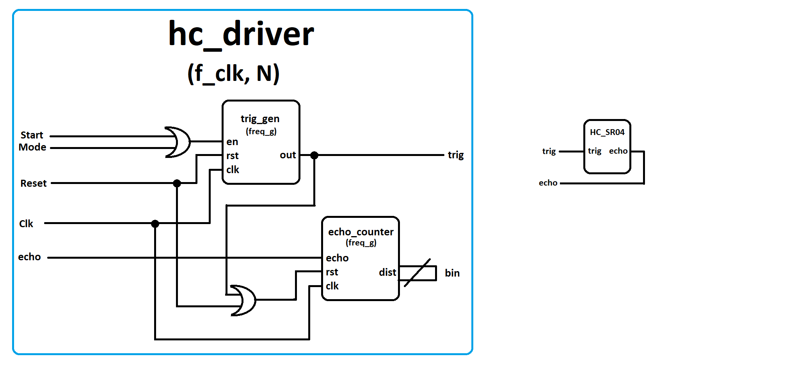

# HC_SR04 Ultrasonic Sensor Driver Documentation

## Operational Description

The driver is designed to facilitate the use of the HC_SR04 ultrasonic sensor with a Spartan 3A (xc3s500e-4fg320) development board. The system can be activated using either a synchronous start input (e.g., a single button click) or a mode input, which should be connected to a switch. When this input is forced to a high state, an automated measurement is performed once the preceding one is completed. Additionally, a reset input (synchronous) is available for user control. The measurement result, saved in NKB, is displayed at the bin output. During implementation, users select the operating frequency and the number of bits at the bin output (minimum 13 bits).

## Structure

- **Trig_gen**: Generates a 10 μs pulse (sensor trigger) and waits for 40 ms.
- **echo_counter**: Counts the pulse duration and translates it to millimeters.

### Sensor Connection

## Control Method

1. The user sends a clock signal to the `clk` input (it must match the previously declared generic `f_clk`). The minimum clock rate for full resolution is 10 MHz.
2. The user can initiate a reset or keep it set to '0'.
3. The operating mode is then selected by either setting the mode input to a constant '1' or forcing the start input once.
4. The distance in millimeters will be measured and presented on a hexadecimal 7-segment display. If the reported result exceeds 4500 (119416), the device did not accurately measure the distance, indicating that the measured item is out of range.

##  Hardware Parameters

### For clk_sys = 10 MHz

- **Timing constraints**: Default Period Analysis for Clock 'CLK_sys'
  - Clock period: 6.217 ns
  - Frequency: 160.849 MHz

### For clk_sys = 50 MHz

- **Timing constraints**: Default Period Analysis for Clock 'CLK_sys'
  - Clock period: 6.338 ns
  - Frequency: 157.778 MHz

### For clk_sys = 100 MHz

- **Timing constraints**: Default Period Analysis for Clock 'CLK_sys'
  - Clock period: 6.376 ns
  - Frequency: 156.838 MHz